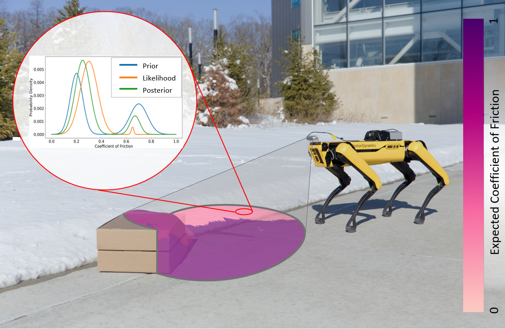
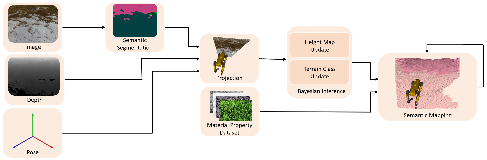
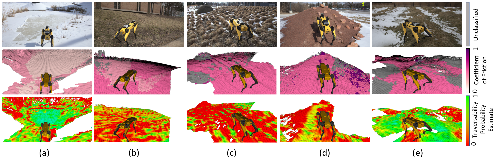

---
# Front matter. This is where you specify a lot of page variables.
title:  "Semantic ELevation (SEL) Map"
date:   2022-05-25 13:23:15 -0400
description: >- # Supports markdown
  Semantic Bayesian inferencing framework for real-time elevation
  mapping and terrain property estimation
show-description: true

# Preview image for social media cards
image:
  path: web_elements/main.png
  height: 76
  width: 116
  alt: Main Figure from Paper

# Only the first author is supported by twitter metadata
authors:
  - name: Parker Ewen
    email: pewen@umich.edu
  - name: Adam Li
    email: adamli@umich.edu
  - name: Yuxin Chen
    email: chyuxin@umich.edu
  - name: Steven Hong
    email: hongsn@umich.edu
  - name: Ram Vasudevan
    email: ramv@umich.edu

author-footnotes: >- # Supports markdown
  All authors affiliated with the Robotics Institute and department of Mechanical Engineering of the University of Michigan, Ann Arbor.

links:
  - icon: bi-file-earmark-text
    icon-library: bootstrap-icons
    text: Paper
    url: https://ieeexplore.ieee.org/abstract/document/9792203/
  - icon: arxiv
    icon-library: simpleicons
    text: ArXiv
    url: https://arxiv.org/abs/2205.12925
  - icon: github
    icon-library: simpleicons
    text: </Code>
    url: https://github.com/roahmlab/sel_map

# End Front Matter
---




# Overview Video
<div class="fullwidth">

</div>

<div markdown="1" class="content-block grey justify">
# Introduction

The equations of motion governing mobile robots are dependent on terrain properties such as the coefficient of friction, and contact model parameters.
Estimating these properties is thus essential for robotic navigation.
Ideally any map estimating terrain properties should run in real time, mitigate sensor noise, and provide probability distributions of the aforementioned properties, thus enabling risk-mitigating navigation and planning.
This paper addresses these needs and proposes a Bayesian inference framework for semantic mapping which recursively estimates both the terrain surface profile and a probability distribution for terrain properties using data from a single RGB-D camera.
The proposed framework is evaluated in simulation against other semantic mapping methods and is shown to outperform these state-of-the-art methods in terms of correctly estimating simulated ground-truth terrain properties when evaluated using a precision-recall curve and the Kullback-Leibler divergence test.
Additionally, the proposed method is deployed on a physical legged robotic platform in both indoor and outdoor environments, and we show our method correctly predicts terrain properties in both cases.
The proposed framework runs in real-time and includes a ROS interface for easy integration.



The image above illustrates the real-time semantic mapping method proposed in this paper which recursively estimates terrain height and friction properties from RGB-D images.
This is done by constructing a triangular mesh to estimate the contact surface of the robot's surroundings (drawn within the grey oval sensor footprint), and the mean and variance of each vertex within the mesh is computed using a one-dimensional Kalman filter at each iteration.
Terrain classes are estimated by combining off-the-shelf semantic segmentation networks with a novel algorithm we develop to recursively estimate terrain properties using Bayesian inference.
These property estimates are full probability distributions (shown in the red inlay for one region) and are computed for each cell within the mesh (the mean estimated friction coefficient is colored according to the given legend).
This algorithm operates at between 5-25Hz and runs on several robot systems including Boston Dynamics's Spot and Agility Robotics's Digit.
</div>

# Method

Here is a flow diagram illustrating out method.
RGB-D images are semantically segmented using an off-the-shelf semantic segmentation network.
Using the camera’s estimated pose and associated depth image, the pixel-wise probabilistic terrain class estimates are projected into the map.
The height map is updated using a 1D Kalman filter and the terrain class estimates, alongside our novel material property dataset, are used to recursively estimate terrain properties for each region of the map.
{: class="justify"}



# Results

We ran our method on the Spot quadruped using an on-board Realsense D435 RGB-D camera.
Experiments were conducted both indoors and outdoors with a variety of terrain classes.
We compared our method to a state-of-the-art traversability mapping framework to demonstrate the utility of our semantic mapping algorithm when compared to a traversability estimation algorithm.
{: class="justify"}



Each column depicts the performance of our proposed mapping algorithm (second row, the first column uses the Context-Encoding ResNet-50 trained on the Pascal dataset while the remaining columns use the RenNet-50 trained on ADE20K for terrain classification) when compared to a traversability estimation algorithm (third row) applied on the scenes depicted in the top row.
Traversability estimation sometimes believes that a region is traversable when it is not, such as an icy surface (column a) or a puddle (column e).
In other scenarios, it believes that an area is intraversable when it is traversable such as on hills (column b, d) and near low vegetation (column c).
Our method makes no claims about traversability, instead it estimates the probability distribution of terrain properties for each mesh element along with the terrain geometry.
{: class="justify"}

<div markdown="1" class="content-block grey justify">
# Citation

* This work is supported by the Ford Motor Company via the Ford-UM Alliance under award N022977, by the Office of Naval Research under award number N00014-18-1-2575, and in part by the National Science Foundation under Grant 1751093.
* `sel_map` was developed in [Robotics and Optimization for Analysis of Human Motion (ROAHM) Lab](http://www.roahmlab.com/) at University of Michigan - Ann Arbor.


```bibtex
@article{9792203,
    author={Ewen, Parker and Li, Adam and Chen, Yuxin and Hong, Steven and Vasudevan, Ram},
    journal={IEEE Robotics and Automation Letters},
    title={These Maps are Made for Walking: Real-Time Terrain Property Estimation for Mobile Robots},
    year={2022},
    volume={7},
    number={3},
    pages={7083-7090},
    doi={10.1109/LRA.2022.3180439}}
```

</div>